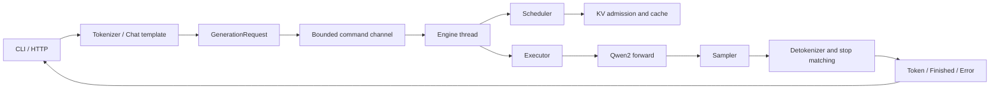

# Understanding mini-vllm-rs: A Hands-on Guide to LLM Inference

[中文版](TUTORIAL.zh-CN.md) · [Project README](../README.md) · [Design document, Chinese](../DESIGN.md)

This tutorial follows the repository's actual implementation. Its goal is to help you trace a request, explain the important tensor shapes, and test changes to the system. It describes the code after correctness fixes, mixed chunk scheduling, and physical KV paging. Features proposed in the design drafts are not necessarily implemented. See the [implementation guide](IMPLEMENTATION.md) for controls and validation.

You should be comfortable with basic Rust, ownership, matrix multiplication, and elementary probability. Prior knowledge of vLLM is unnecessary. On your first pass, you can skip the formulas, run the tests, and return to the model internals later.

## 1. Learning path and first steps

| Stage | Question to answer | Sections |
|---|---|---|
| 1: Request path | How does text become generation events? | 2–3 |
| 2: Model computation | How are next-token logits computed? | 4–5 |
| 3: Resources and concurrency | How do requests share a model and memory? | 6–7 |
| 4: Output semantics | How do sampling, stopping, and streaming work? | 8–9 |
| 5: Verification and extensions | How can you prove an optimization preserves correctness? | 10–13 |

Start from the repository root with tests that require no model download:

```bash
cargo test --workspace
cargo test -p mini-vllm-model cached_logits_match_nocache_logits
cargo test -p mini-vllm-engine admission_reserves_each_requests_horizon
cargo test -p mini-vllm-tokenizer --features test-util stop_prefix_is_withheld_across_tokens
```

The model tests use small, randomly initialized weights. They test shapes, cache equivalence, and request lifecycles, not natural-language quality. Each construction of `random_model` may produce different weights: comparisons between execution paths must share the same model.

For real generation, prepare a local Qwen2/Qwen2.5 directory containing `config.json`, `tokenizer.json`, and Safetensors weights. Sharded weights also require their index file. Replace the model path below with your local directory:

```bash
cargo run --release -p mini-vllm-cli -- inspect \
  --model ./models/qwen2.5-0.5b-instruct --device cpu

cargo run --release -p mini-vllm-cli -- generate \
  --model ./models/qwen2.5-0.5b-instruct --device cpu --dtype f32 \
  --prompt "The capital of France is" --max-new-tokens 16 --temperature 0
```

CPU/F32 provides a straightforward baseline. `--device auto` chooses CUDA, Metal, or CPU according to the build and available devices. In this project, `--dtype auto` selects F32; it does not automatically adopt the weight dtype.

## 2. Responsibilities of the eight crates



| Crate | Responsibility | Starting point |
|---|---|---|
| `core` | Requests, events, sampling parameters, engine configuration | [types.rs](../crates/mini-vllm-core/src/types.rs) |
| `tokenizer` | Text encoding, ChatML, incremental decoding | [tokenizer.rs](../crates/mini-vllm-tokenizer/src/tokenizer.rs) |
| `model` | Weight loading and Qwen2 forward computation | [qwen2.rs](../crates/mini-vllm-model/src/qwen2.rs) |
| `kv` | Actual KV tensors and capacity accounting | [cache.rs](../crates/mini-vllm-kv/src/cache.rs), [manager.rs](../crates/mini-vllm-kv/src/manager.rs) |
| `sampling` | Converting logits into a token ID | [sampler.rs](../crates/mini-vllm-sampling/src/sampler.rs) |
| `engine` | Lifecycle, scheduling, execution, metrics | [engine.rs](../crates/mini-vllm-engine/src/engine.rs) |
| `server` | JSON, HTTP, and SSE protocol adaptation | [api.rs](../crates/mini-vllm-server/src/api.rs) |
| `cli` | The inspect, generate, and serve commands | [main.rs](../crates/mini-vllm-cli/src/main.rs) |

Rust ownership expresses the system boundaries. HTTP callers hold a cloneable `EngineHandle` and send commands through a channel. A dedicated OS thread owns mutable scheduler, sequence, and KV state. Model execution is synchronous work, so it does not run directly inside an asynchronous HTTP handler. The model is shared through `Arc<dyn CausalLm>`, while each sequence owns its cache.

## 3. Follow one request

For `/v1/chat/completions`, read the following functions in order:

1. `api::chat_completions` reads messages and sampling parameters.
2. `QwenChatTemplate::render` builds ChatML and appends an assistant opening.
3. `TokenizerWrapper::encode` produces token IDs. Automatic special-token insertion is disabled here because the rendered template already includes them.
4. `submit` creates a `GenerationRequest`; `EngineHandle::generate` submits a command with `try_send` and returns a bounded event receiver.
5. `enqueue_request` checks the context limit, prefill budget, and whether one request can fit the KV pool. It creates a sampler and detokenizer for that request.
6. Admission allocates KV storage. The executor prefills the prompt and samples the first new token.
7. Each subsequent decode feeds the previous generated token back into the model until a stop condition, length limit, cancellation, or error.
8. The JSON path concatenates text; the SSE path converts events into stream frames. Retirement releases KV resources.

A ChatML example:

```text
<|im_start|>user
What is a KV cache?<|im_end|>
<|im_start|>assistant
```

This is an explicitly implemented template, not a general Jinja interpreter. It does not automatically execute arbitrary template logic from a model directory.

**Check your understanding:** Why can the server respond after generating one token? Autoregressive generation predicts the next token at each step, and the event protocol supports sending each available increment independently.

## 4. Prefill and decode: the critical timeline

Suppose the prompt contains three tokens, `[p0, p1, p2]`, and the generation budget is three tokens.

| Call | Input tokens | Absolute positions | KV length after forward | Sample from logits |
|---|---|---|---:|---|
| Prefill | `[p0, p1, p2]` | `[0, 1, 2]` | 3 | `g0` |
| Decode 1 | `[g0]` | `[3]` | 4 | `g1` |
| Decode 2 | `[g1]` | `[4]` | 5 | `g2`, reaching the length limit |

`g2` has been produced, but there is no need to feed it back into the model, so it does not need a KV entry. **Generated-token count and cached-token count are different quantities.** The reservation is `3 + 3 = 6`, although only five positions are used at the end. Reserving the full horizon is conservative.

Read `next_input_position` in [sequence.rs](../crates/mini-vllm-engine/src/sequence.rs). With prompt length `P` and `G` generated tokens, the next input position is `P + G - 1`. Positions are zero-based.

`forward_nocache` recomputes the full prefix. `forward_cached` retains earlier K/V and computes representations for the new inputs. A decode query has length one, but it still reads historical K/V: caching does not make attention cost independent of context length.

## 5. Work through the Qwen2 tensor shapes

Let `T` be the total number of input tokens in this call, `H` the hidden size, `Nq` the number of query heads, `Nkv` the number of KV heads, `d = H/Nq`, `V` the vocabulary size, and `I` the MLP intermediate size.

| Operation | Shape |
|---|---|
| Token embedding | `[T] → [T, H]` |
| Q projection | `[T, H] → [T, Nq*d]` |
| K/V projections | Each: `[T, H] → [T, Nkv*d]` |
| Q reshape for one sequence | `[q_len, Nq*d] → [Nq, q_len, d]` |
| Historical K/V for one sequence | Each: `[Nkv, kv_len, d]` |
| Attention scores | Dense: `[Nq, q_len, kv_len]`; paged workspace: `[Nq, q_len, page_len]` |
| Attention output and O projection | `[q_len, H]` |
| MLP | `[T, H] → [T, I] → [T, H]` |
| LM head on last positions | `[num_seqs, H] → [num_seqs, V]` |

Each decoder layer computes:

```text
x = x + Attention(RMSNorm(x))
x = x + MLP(RMSNorm(x))
```

- **RMSNorm:** `y = x / sqrt(mean(x²) + eps) * weight`. Normalization is over the feature dimension. The implementation computes in F32 and casts back to the input dtype. See [rms_norm.rs](../crates/mini-vllm-model/src/rms_norm.rs).
- **RoPE:** `q_rot = q*cos(position) + rotate_half(q)*sin(position)`, with the same operation on K. Position controls the rotation angle. Cached keys have already been rotated. See [rope.rs](../crates/mini-vllm-model/src/rope.rs).
- **GQA:** Several query heads share each KV head. With `Nq=4, Nkv=2`, the conceptual expansion is `[kv0, kv0, kv1, kv1]`. This implementation explicitly repeats KV for attention, but stores only `Nkv` heads in the cache.
- **Causal attention:** `softmax(QKᵀ/sqrt(d) + mask)V`. During prefill, position i cannot see later positions. A decode query can see the existing cache and its own new position. See [attention.rs](../crates/mini-vllm-model/src/attention.rs).
- **SwiGLU:** `down(silu(gate(x)) * up(x))`, where the multiplication is elementwise. See [mlp.rs](../crates/mini-vllm-model/src/mlp.rs).
- **LM head:** Projects hidden states to vocabulary logits. Tied embeddings reuse the embedding weights. The cached path selects each sequence's last position so it does not compute vocabulary logits for every prompt position.

**Exercise:** With `H=32, Nq=4, Nkv=2`, decode one token for each of two sequences. Answer: `T=2, d=8`; Q projection is `[2,32]`, K/V projections are `[2,16]`, per-sequence Q is `[4,1,8]`, and final logits are `[2,V]`.

## 6. KV cache: distinguish storage from accounting

The default path in [paged.rs](../crates/mini-vllm-kv/src/paged.rs) creates physical pages lazily, each holding K/V tensors of shape `[Nkv, block_size, d]` with views limited to valid positions. Full pages are shared through Arc; exclusive tails append in place and shared tails use copy-on-write. `--contiguous-kv` selects the preallocated reference in [cache.rs](../crates/mini-vllm-kv/src/cache.rs), using `scatter_set` writes and `narrow` reads.

Ignoring allocator overhead, one sequence's KV tensor memory is approximately:

```text
bytes = 2 * num_layers * Nkv * d * capacity * bytes_per_element
```

For the test model with two layers, two KV heads, head dimension eight, capacity 64, and F32: `2*2*2*8*64*4 = 16384` bytes, or 16 KiB. This excludes model weights, temporary attention tensors, and other runtime memory.

[manager.rs](../crates/mini-vllm-kv/src/manager.rs) tracks logical blocks:

```text
needed_blocks = ceil((prompt_len + max_new_tokens - pinned_shared_prefix) / block_size)
```

With block size 16 and horizon 33, the manager reserves three blocks; physical page tensors are allocated on demand. Attention reads page lists directly, normalizes across pages, and accumulates their contributions. These portable Candle operations are not a fused GPU PagedAttention kernel.

Cold admission reserves the full horizon, trading some concurrency for capacity predictability during decode. `--prefix-cache-tokens` enables a block trie of shared prefixes with unpinned-leaf LRU eviction with an additional, separate budget. Hits skip prompt computation and deduct the shared prefix from active admission. A reference-counted pin keeps that prefix charged to the retention pool until all active borrowers release it; pinned entries cannot be evicted. Total pool blocks are also rounded up, so `max_kv_tokens` is not a byte-exact GPU memory limit.

**Capacity exercise:** The pool has three blocks and each request needs two. A and B arrive together. After admitting A, the current admission budget must decrease from three to one; B waits. Checking “2 ≤ 3” separately for both requests would over-admit them.

## 7. Continuous batching and scheduling

Read [scheduler.rs](../crates/mini-vllm-engine/src/scheduler.rs) and `Engine::step`. The current iteration order is:

```text
cancel checks → retire → admit → run_mixed_step → retire → update_gauges
```

The second retirement matters: requests that fail in this iteration must release resources and send terminal events before the engine goes idle.

Scheduling is FIFO, constrained by `max_num_seqs` and available KV capacity. A head request that cannot fit prevents later requests from being admitted: this is head-of-line blocking. Requests can complete, leave, and join between iterations, so batch membership changes over time.

`BatchTokens` now drives genuinely mixed calls: a forward can contain decode tokens and prefill chunks of different lengths. Partial prefills do not sample; only the final prompt chunk produces the first generated token. Decode selection rotates when necessary, and a budget greater than one reserves at least one token for pending prefill.

`max_batch_tokens` is a combined prefill/decode input-token budget. Prompts larger than one iteration advance in chunks; requests exceeding model context or individual KV capacity are rejected.

A Rust ownership detail: the executor temporarily uses `take_cache` to move caches out of their sequences, constructs a mutable cache array, calls the model, and puts them back with `restore_cache`. This organizes batching within borrowing rules; it does not mean the cache tensors are copied.

## 8. From logits to a token

The actual order in [Sampler::sample](../crates/mini-vllm-sampling/src/sampler.rs) is:

```text
repetition penalty → temperature → top-k → softmax → top-p → random draw
```

Temperature zero selects greedy argmax and skips probabilistic sampling. The implementation also treats nonnegative temperatures no greater than `f32::EPSILON` as greedy.

Repetition penalty uses the set of prompt and generated token IDs. With a penalty greater than one, a seen token's positive logit is divided by the penalty, while a negative logit is multiplied by it. Both reduce its relative preference. Top-k keeps k candidates. Top-p sorts by probability and retains the smallest prefix reaching the cumulative threshold.

For probabilities `[0.6,0.3,0.1]` and `top_p=0.8`, the first two tokens remain; sampling uses their retained total probability. Top-p does not mean “keep tokens whose individual probability exceeds 0.8.”

Each request has its own RNG. An explicit seed isolates sampling randomness between requests, but does not guarantee identical tokens across different batch layouts, devices, or dtypes. Floating-point differences in batched GEMM can change an argmax when logits nearly tie.

## 9. Streaming is a protocol problem

A token is not a character. A multibyte character may require multiple tokens to decode, and one token may produce several characters. `IncrementalDetokenizer` uses a sliding window and emits text increments it can confirm.

Stop strings require additional buffering. Suppose the decoded increments are `a`, ` b`, and ` c`, with stop string `b c`:

| Newly decoded text | Text safe to send | Text withheld |
|---|---|---|
| `a` | `a` | Empty |
| ` b` | One space | `b` |
| ` c` | Empty; stop matched | Discard `b c` |

The final output is `a `. If generation instead reaches its token limit after the second step, there is no complete stop match: `finish()` releases `b`, producing `a b`. Normal EOS termination needs the same treatment. Editing a server's final string cannot retract a stop prefix already sent through SSE.

[SequenceGroup::emit](../crates/mini-vllm-engine/src/sequence.rs) uses a bounded channel and bounded outbox, always sending from the front to preserve order. The engine does not wait for network delivery. Retirement first releases KV, then drains output within `--output-drain-timeout-ms`. Timeout or outbox overflow cancels instead of reporting a successful `Length` or `Stop`. Draining still holds a request permit, bounding outstanding delivery state.

The HTTP JSON path reports cancellation, failure, or a missing terminal event as an error. SSE emits an error payload for these cases, then ends with `[DONE]`. **`[DONE]` means the stream ended; it does not establish successful generation.** The CLI also fails when a terminal event is missing.

On disconnect, a guard sets an independent cancellation flag without needing command-channel capacity. Normal completion genuinely disarms it. Each iteration checks waiting/running requests for cancellation and receiver closure. Cancellation takes effect at scheduling boundaries; it does not forcibly interrupt a synchronous forward call.

## 10. Five fixes as lessons in system design

| Defect | Trigger and consequence | Repair principle | Regression test |
|---|---|---|---|
| Over-admission | Multiple requests see the same remaining KV budget | Deduct each reservation during admission | `admission_reserves_each_requests_horizon` |
| Failure hangs | Prefill fails, no new command arrives, retirement never happens | Clean up before blocking for input | `prefill_failure_finishes_and_releases_kv_without_new_commands` |
| Successful but truncated output | Terminal delivery skips queued tokens | Ordered delivery; cancel if incomplete | `retirement_never_reports_success_after_dropping_queued_tokens` |
| Retry corrupts KV | A batch fails after writing some layers | Rewind cache cursors before retry | `failed_batch_rolls_back_before_individual_retry` |
| Stop prefix leaks | A stop spans multiple increments | Withhold possible prefixes; flush on normal finish | `engine_stop_matching_and_normal_finish_preserve_text` |

Walk through cache rollback separately. Two layers start with lengths `[1,1]`. A partial failure leaves `[2,1]`. Retrying immediately produces `[3,2]`. Rewinding first to `[1,1]` allows the retry to produce the correct `[2,2]`.

`KvCache::truncate` restores valid lengths in contiguous storage and trims page tables/partial pages in paged storage. This works because forward is append-only and shared historical pages are immutable. If a future compression algorithm modifies historical KV in place, this rollback strategy must be reconsidered. The executor also checks the complete logits row count before sampling, preventing a failed attempt from advancing only some requests' RNGs.

## 11. Experiments: verify invariants

Run these commands from the repository root. Predict the outcome before reading each test's assertions.

```bash
# Cached execution should agree closely with full recomputation
cargo test -p mini-vllm-model cached_logits_match_nocache_logits

# Queued requests should eventually succeed and return their KV reservations
cargo test -p mini-vllm-engine admission_reserves_each_requests_horizon

# A failure must not retain resources indefinitely
cargo test -p mini-vllm-engine prefill_failure_finishes_and_releases_kv_without_new_commands

# Retried KV contents should match an independent successful execution
cargo test -p mini-vllm-engine failed_batch_rolls_back_before_individual_retry

# Cross-token stops, length termination, and EOS termination
cargo test -p mini-vllm-engine engine_stop_matching_and_normal_finish_preserve_text
cargo test -p mini-vllm-tokenizer --features test-util multibyte_stop_prefixes_preserve_utf8_boundaries

# JSON and both SSE endpoints must not report interrupted output as success
cargo test -p mini-vllm-server interrupted_generations_are_errors_in_json_and_sse
```

Further experiments and acceptance criteria:

1. **Capacity:** Change the horizon and block size in the test, then add a third request. Accept only if there is no over-admission, FIFO order is preserved, and used blocks return to zero.
2. **Fault injection:** Make a sequence fail after writing the second layer. Other sequences' recovered KV must match a successful reference execution. With equal seeds, also check that a failed attempt does not advance sampling RNG prematurely.
3. **Overlapping stops:** Try `ab` and `abc`, Chinese text, an empty stop, and a partial match at the end. Output should precede the first stop that has fully matched; normal completion without a match must retain the suffix.
4. **Backpressure:** Reduce event-channel capacity and delay reading. Other requests must continue. The affected request must either succeed completely or explicitly cancel/fail, never silently succeed with truncated text.

Ordinary tests also run an independently generated Transformers tiny-model fixture. An opt-in real Qwen2.5-0.5B CPU/F32 test verifies weight hashes and sampled reference logits. See the [implementation guide](IMPLEMENTATION.md) for provenance, tolerances, and commands.

## 12. Serve requests and interpret metrics

```bash
cargo run --release -p mini-vllm-cli -- serve \
  --model ./models/qwen2.5-0.5b-instruct --device cpu --dtype f32 \
  --host 127.0.0.1 --port 8000 \
  --max-num-seqs 4 --max-batch-tokens 512 --max-kv-tokens 4096
```

In another terminal:

```bash
curl -N http://127.0.0.1:8000/v1/completions \
  -H 'Content-Type: application/json' \
  -d '{"prompt":"Explain KV caching briefly.","max_tokens":32,"temperature":0,"stream":true}'

curl http://127.0.0.1:8000/metrics
python3 scripts/benchmark.py --requests 8 --concurrency 1 4 --max-tokens 32
```

| Metric | Meaning in the current code | Interpretation |
|---|---|---|
| `time_to_first_token_ms_avg` | Sequence creation to first sample | Excludes some HTTP/tokenization overhead; not client time to first byte |
| `inter_token_latency_ms_avg` | Time between samples inside the engine | Not the client's text-chunk interval |
| `average_decode_batch_size` | Sum of decode batch sizes / decode steps | Not waiting-queue length |
| `tokens_per_second` | Generated tokens over the trailing ten-second window | Lifetime average is `lifetime_tokens_per_second` |
| `kv_blocks_used` | Reserved blocks | Not written tokens or measured GPU memory |

The benchmark reads exact token counts from terminal usage, requires a successful terminal frame and `[DONE]`, and reports failures separately. Empty token events participate in latency measurements; warmup requests are excluded from scenario timing. Fix the model, device, dtype, prompt, output budget, and concurrency when comparing runs; separate cold start from steady-state measurements.

## 13. Where to go next

These mechanisms now have baseline implementations. Keep the correctness reference while extending them, and preserve these acceptance criteria:

| Direction | Boundaries to change | Minimum acceptance criteria |
|---|---|---|
| Bounded waiting queue | Request admission and scheduler | Memory remains bounded under sustained overload; new requests receive explicit rejection |
| Chunked prefill | Scheduler, positions, budgets | Long prompts make progress and agree closely with full prefill |
| Combined prefill/decode batches | Executor batch construction | Mixed-length logits agree closely with independent execution |
| Prefix caching | KV ownership, sharing, reclamation | Shared prefixes remain intact; cancelling one request does not damage another |
| Physical paged attention | KV storage and attention kernel | Correct cross-block addressing, reclamation, reuse, and numerical equivalence |
| Reference-model alignment | Test fixtures and numerical comparison | Explainable per-step logits differences with fixed real weights |

Current boundaries include a single engine thread, per-sequence attention, no fused paged GPU kernel, and no general chat-template interpreter. The command channel, waiting queue, and total outstanding requests now have separate bounds; paging, prefix reuse, and chunked prefill have testable baseline implementations. Understanding these distinctions separates learning a concept from implementing the complete production mechanism.

## 14. Bilingual glossary and self-check

| 中文 | English | Meaning in this project |
|---|---|---|
| 预填充 | Prefill | Process the prompt and obtain logits for the first generated token |
| 解码步 | Decode step | Feed the previous generated token to predict the next |
| 连续批处理 | Continuous batching | Allow membership to change between iterations |
| 准入控制 | Admission control | Decide whether a request may reserve a running slot and KV capacity |
| 缓存跨度 | Horizon | Reserved `prompt_len + max_new_tokens` capacity |
| 背压 | Backpressure | Queueing and cancellation when consumers cannot keep up |
| 终态事件 | Terminal event | Finished or Error, establishing a request's outcome |
| 回退 | Rollback | Restore retryable state after failure |
| 首 token 延迟 | Time to first token / TTFT | A latency whose start and end boundaries must be stated |

Close the code and answer: Why might the last generated token never enter KV? Why are KV blocks not a direct measurement of GPU memory? Why does each request need its own RNG? Why can editing a final string not repair already-sent SSE? Why must “catch an error and retry” account for cache side effects?

The answers are in sections 4, 6, 8, 9, and 10 respectively. If you can explain them using the actual functions, you understand the project's most important system boundaries.

## 15. Advanced experiments / 进阶实验

See [Advanced runtime experiments](ADVANCED_RUNTIME.md): configure defaults and deadlines, derive the online softmax recurrence, inspect deduplicated block-trie ownership, replay JSONL traces, and vary workload length/concurrency/prefix reuse. The measured GPU limitations are listed separately from implemented test entry points.

## Inference efficiency and scheduling fairness

Continue with [inference efficiency and fair-load experiments](inference-efficiency.md): selective prefill logits, grouped attention without KV duplication, and FIFO versus bounded lookahead. Exercise: increase the fixed arrival rate while observing tail latency, failures and queue length; explain when the age barrier stops bypasses.
