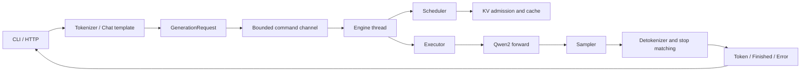

# 从零读懂 mini-vllm-rs：LLM 推理系统实践教程

[English edition](TUTORIAL.en.md) · [项目首页](../README.md) · [设计文档](../DESIGN.md)

这是一份围绕仓库实际实现的教程。目标是让你能沿着一条请求读懂系统、解释关键张量的形状，并用测试验证自己的修改。本文描述的是包含正确性修复、混合分块调度和物理分页缓存后的代码；设计草案中的规划不等于已实现功能。新增参数与验证步骤见 [实现与验证](IMPLEMENTATION.md)。

适合已经了解 Rust 基础语法、所有权、矩阵乘法和基本概率的读者。不要求先理解 vLLM。第一次阅读可跳过公式，先跑测试，再回到模型部分。

## 1. 学习路线与第一步

| 阶段 | 要回答的问题 | 建议阅读 |
|---|---|---|
| 1：请求链路 | 一段文本如何变成生成事件？ | 第 2、3 节 |
| 2：模型计算 | 一个 token 的 logits 如何算出来？ | 第 4、5 节 |
| 3：资源与并发 | 多个请求如何共享模型和内存？ | 第 6、7 节 |
| 4：输出语义 | 如何正确采样、停止和流式返回？ | 第 8、9 节 |
| 5：验证与改进 | 怎样证明优化没有破坏正确性？ | 第 10—13 节 |

先在仓库根目录运行不需要下载模型的测试：

```bash
cargo test --workspace
cargo test -p mini-vllm-model cached_logits_match_nocache_logits
cargo test -p mini-vllm-engine admission_reserves_each_requests_horizon
cargo test -p mini-vllm-tokenizer --features test-util stop_prefix_is_withheld_across_tokens
```

模型测试使用小尺寸随机权重。它们适合验证张量形状、缓存等价性和请求生命周期，不用于判断自然语言输出质量。`random_model` 每次构造的权重可能不同；比较两条执行路径时必须共享同一个模型。

要体验真实生成，先准备一个本地 Qwen2/Qwen2.5 模型目录，包含 `config.json`、`tokenizer.json` 和 Safetensors 权重；分片权重还需要索引文件。以下命令中的路径需要替换为你的模型目录：

```bash
cargo run --release -p mini-vllm-cli -- inspect \
  --model ./models/qwen2.5-0.5b-instruct --device cpu

cargo run --release -p mini-vllm-cli -- generate \
  --model ./models/qwen2.5-0.5b-instruct --device cpu --dtype f32 \
  --prompt "The capital of France is" --max-new-tokens 16 --temperature 0
```

这里显式选择 CPU/F32，方便建立可理解的基线。`--device auto` 按当前构建和可用设备选择 CUDA、Metal 或 CPU；`--dtype auto` 在本项目中选择 F32，不会自动跟随权重 dtype。

## 2. 八个 crate 如何分工



| crate | 职责 | 入口文件 |
|---|---|---|
| `core` | 请求、事件、采样参数和引擎配置 | [types.rs](../crates/mini-vllm-core/src/types.rs) |
| `tokenizer` | 文本编码、ChatML、增量解码 | [tokenizer.rs](../crates/mini-vllm-tokenizer/src/tokenizer.rs) |
| `model` | 权重加载及 Qwen2 前向计算 | [qwen2.rs](../crates/mini-vllm-model/src/qwen2.rs) |
| `kv` | 实际 KV 张量与容量记账 | [cache.rs](../crates/mini-vllm-kv/src/cache.rs)、[manager.rs](../crates/mini-vllm-kv/src/manager.rs) |
| `sampling` | logits 到 token ID | [sampler.rs](../crates/mini-vllm-sampling/src/sampler.rs) |
| `engine` | 生命周期、调度、执行、指标 | [engine.rs](../crates/mini-vllm-engine/src/engine.rs) |
| `server` | JSON、HTTP、SSE 协议适配 | [api.rs](../crates/mini-vllm-server/src/api.rs) |
| `cli` | inspect、generate、serve 命令 | [main.rs](../crates/mini-vllm-cli/src/main.rs) |

Rust 的所有权在这里表达系统边界：HTTP 层持有可克隆的 `EngineHandle`，通过 channel 发命令；专用 OS 线程拥有可变的 scheduler、sequence 和 KV 状态。模型执行是同步工作，因此没有直接放进 HTTP 的异步 handler。模型通过 `Arc<dyn CausalLm>` 共享，缓存仍属于各个序列。

## 3. 跟踪一条请求

以 `/v1/chat/completions` 为例，按以下顺序设置阅读断点：

1. `api::chat_completions` 读取消息和采样参数。
2. `QwenChatTemplate::render` 将消息拼成 ChatML，末尾追加 assistant 开头。
3. `TokenizerWrapper::encode` 生成 token IDs。模板已包含特殊 token，因此这里关闭自动添加特殊 token。
4. `submit` 构造 `GenerationRequest`；`EngineHandle::generate` 使用 `try_send` 提交命令，返回有界事件接收端。
5. `enqueue_request` 再验证上下文、prefill 预算和单请求 KV 容量，创建独立 sampler 与 detokenizer。
6. scheduler 准入后分配 KV，executor 执行 prefill，采样第一个新 token。
7. 后续 decode 每次输入上一个新 token，直到 stop、长度限制、取消或错误。
8. JSON 路径拼接文本；SSE 路径将事件转换为流式响应。退休阶段释放 KV。

ChatML 示例：

```text
<|im_start|>user
What is a KV cache?<|im_end|>
<|im_start|>assistant
```

这里是显式实现的模板，不是通用 Jinja 解释器，也不会自动执行模型目录中的任意模板逻辑。

**检查理解：** 为什么生成一个新 token 就可以响应客户端，而不必等整段文本？因为自回归模型每一步预测下一个 token，事件协议允许每次采样后独立发送增量。

## 4. Prefill 与 decode：最容易混淆的时间线

假设 prompt 是三个 token `[p0, p1, p2]`，最多生成三个 token。

| 调用 | 输入 token | 绝对位置 | 前向完成后的 KV 长度 | 根据 logits 采样 |
|---|---|---|---:|---|
| prefill | `[p0, p1, p2]` | `[0, 1, 2]` | 3 | `g0` |
| decode 1 | `[g0]` | `[3]` | 4 | `g1` |
| decode 2 | `[g1]` | `[4]` | 5 | `g2`，达到长度限制 |

`g2` 已经输出，但不必再送入模型，因此不必写入 KV。**已生成 token 数与已缓存 token 数不是同一个量。** 这里预留容量是 `3 + 3 = 6`，实际最后使用 5 个位置；预留完整 horizon 是保守策略。

阅读 [sequence.rs](../crates/mini-vllm-engine/src/sequence.rs) 的 `next_input_position`：已生成 `G` 个 token、prompt 长度为 `P` 时，下次输入的位置为 `P + G - 1`。模型位置从零开始计数。

`forward_nocache` 每次重算完整前缀；`forward_cached` 保存旧位置的 K/V，只计算新输入对应的表示。decode 的 query 长度是 1，但仍要读取历史 K/V，所以缓存不代表每步 attention 的成本与上下文长度无关。

## 5. 手算一次 Qwen2 前向的形状

设 `T` 为本次输入 token 总数，`H` 为 hidden size，`Nq` 为 query 头数，`Nkv` 为 KV 头数，`d = H/Nq`，`V` 为词表大小，`I` 为 MLP 中间维度。

| 运算 | 形状 |
|---|---|
| token embedding | `[T] → [T, H]` |
| Q 投影 | `[T, H] → [T, Nq*d]` |
| K/V 投影 | 各为 `[T, H] → [T, Nkv*d]` |
| 单序列 Q 重排 | `[q_len, Nq*d] → [Nq, q_len, d]` |
| 单序列历史 K/V | 各为 `[Nkv, kv_len, d]` |
| attention scores | `[Nq, q_len, kv_len]` |
| attention 输出与 O 投影 | `[q_len, H]` |
| MLP | `[T, H] → [T, I] → [T, H]` |
| 最后位置的 LM head | `[num_seqs, H] → [num_seqs, V]` |

每一层的结构是：

```text
x = x + Attention(RMSNorm(x))
x = x + MLP(RMSNorm(x))
```

- **RMSNorm**：`y = x / sqrt(mean(x²) + eps) * weight`。沿特征维度归一化；实现用 F32 完成计算，再转回输入 dtype。见 [rms_norm.rs](../crates/mini-vllm-model/src/rms_norm.rs)。
- **RoPE**：`q_rot = q*cos(position) + rotate_half(q)*sin(position)`，K 同理。当前位置改变旋转角度；缓存的 K 已经旋转过。见 [rope.rs](../crates/mini-vllm-model/src/rope.rs)。
- **GQA**：多个 query 头共享一组 KV 头。当 `Nq=4, Nkv=2` 时，概念上扩展为 `[kv0, kv0, kv1, kv1]`。本实现显式重复 KV 参与 attention；缓存仍只存 `Nkv` 个头。
- **因果 attention**：`softmax(QKᵀ/sqrt(d) + mask)V`。prefill 中位置 i 不得看到后续位置；decode 只有新位置的 query，可以看到已有缓存和自己。见 [attention.rs](../crates/mini-vllm-model/src/attention.rs)。
- **SwiGLU**：`down(silu(gate(x)) * up(x))`，乘法为逐元素乘法。见 [mlp.rs](../crates/mini-vllm-model/src/mlp.rs)。
- **LM head**：将 hidden states 投影到词表 logits。权重绑定时复用 embedding 权重；cached 路径只取每个序列最后位置，避免给所有 prompt 位置计算最终词表 logits。

**练习：** `H=32, Nq=4, Nkv=2`，两个序列各 decode 一个 token。答案：`T=2, d=8`，Q 投影 `[2,32]`，K/V 投影 `[2,16]`，每个序列的 Q `[4,1,8]`，最终 logits `[2,V]`。

## 6. KV 缓存：分开理解存储与记账

默认分页路径在 [paged.rs](../crates/mini-vllm-kv/src/paged.rs) 中按需创建物理页，每页 K/V 的形状为 `[Nkv, block_size, d]`，读取视图只暴露有效位置。完整页通过 Arc 共享，独占尾页原地追加，共享尾页写入前复制。`--contiguous-kv` 选择 [cache.rs](../crates/mini-vllm-kv/src/cache.rs) 的预分配连续参考路径，使用 `scatter_set` 写入、`narrow` 读取。

忽略分配器开销，单序列 KV 张量占用约为：

```text
bytes = 2 * num_layers * Nkv * d * capacity * bytes_per_element
```

以测试模型为例：2 层、2 个 KV 头、head dim 8、capacity 64、F32：`2*2*2*8*64*4 = 16384` 字节，即 16 KiB。这不包含模型权重、attention 临时张量或其他运行时内存。

[manager.rs](../crates/mini-vllm-kv/src/manager.rs) 管理的是逻辑块：

```text
needed_blocks = ceil((prompt_len + max_new_tokens - pinned_shared_prefix) / block_size)
```

例如 block size 为 16、horizon 为 33，需记账 3 个块；分页张量按需分配。attention 直接读取页列表，跨页统一 softmax 后累加各页贡献；它仍使用通用 Candle 算子，不是融合 GPU PagedAttention kernel。

未命中前缀时，准入预留完整 horizon，牺牲部分并发度以避免后续 decode 争抢容量。`--prefix-cache-tokens` 以额外的独立预算启用 LRU 前缀共享，命中后跳过相应 prompt 计算，同时从活动请求预算中扣除共享前缀。引用计数 pin 确保借用期间前缀始终记在保留池中，不能被 LRU 淘汰。当前总块数也向上取整，所以 `max_kv_tokens` 不是字节级精确的显存硬上限。

**容量练习：** 总共 3 块，每个请求要 2 块，同时来 A、B 两个请求。A 准入后，本轮可用预算必须从 3 变成 1；B 排队。只分别检查“2 ≤ 3”会错误地准入两个请求。

## 7. 连续批处理与调度

阅读 [scheduler.rs](../crates/mini-vllm-engine/src/scheduler.rs) 和 `Engine::step`。当前每轮顺序为：

```text
cancel checks → retire → admit → run_mixed_step → retire → update_gauges
```

第二次 retire 很重要：当前轮失败的请求必须在进入 idle 等待前释放资源并发送终态。

调度是 FIFO，受 `max_num_seqs` 和 KV 可用容量限制。队首放不下会阻止后面的请求准入，这叫队首阻塞。每轮可能有请求完成、退出和加入，因此 batch 成员可以变化。

`BatchTokens` 现在用于真正的混合调用：同一次 forward 可以包含多个 decode token 和不同长度的 prefill 分块。部分 prefill 完成后不采样；只有最后一个 prompt 分块产生第一个新 token。decode 优先且轮转选择，预算大于 1 时为待处理 prefill 至少保留一个 token。

`max_batch_tokens` 是 prefill 与 decode 的合计输入 token 预算。超过单轮预算的 prompt 会分块推进；超过模型上下文或单请求 KV 容量才会被拒绝。

Rust 阅读要点：executor 临时用 `take_cache` 移出各序列的缓存，构建可变 cache 数组，完成模型调用后再 `restore_cache`。这是在安全借用约束下组织批量执行，不意味着缓存被复制。

## 8. 从 logits 到 token

[Sampler::sample](../crates/mini-vllm-sampling/src/sampler.rs) 的实际顺序是：

```text
repetition penalty → temperature → top-k → softmax → top-p → random draw
```

temperature 为零时走 greedy argmax，跳过概率采样；实现也把不大于 `f32::EPSILON` 的非负值作为 greedy。

重复惩罚使用 prompt 与已生成 token 的集合。参数大于 1 时，已出现 token 的正 logit 除以参数，负 logit 乘以参数，从而降低其相对偏好。top-k 保留 k 个候选；top-p 按概率从大到小保留达到累计阈值的最小前缀。

例子：概率 `[0.6,0.3,0.1]`，`top_p=0.8`，保留前两个 token，随后按保留概率的总和进行抽样。不是保留所有“概率大于 0.8”的 token。

每个请求拥有自己的 RNG。指定 seed 可以隔离请求之间的采样随机性，但不保证不同 batch 布局、设备或 dtype 下逐 token 完全一致。批量 GEMM 的浮点舍入差异可能改变接近并列的 argmax。

## 9. 流式输出其实是一个协议问题

token 不等于字符。多字节字符可能跨 token 解码；一个 token 也可能输出多个字符。`IncrementalDetokenizer` 使用滑动窗口，只输出可确认的文本增量。

停止字符串还需要另一层缓冲。设 token 解码依次产生 `a`、` b`、` c`，stop 为 `b c`：

| 新增解码文本 | 可发送内容 | 暂存内容 |
|---|---|---|
| `a` | `a` | 空 |
| ` b` | 一个空格 | `b` |
| ` c` | 空，命中 stop | 丢弃 `b c` |

最终输出是 `a `。如果在第二步因为 max tokens 而结束，则尚未形成 stop，`finish()` 应释放 `b`，最终输出 `a b`。EOS 正常结束也需要这一处理。不能在已发送 stop 前缀后靠修改服务器内部的最终字符串补救 SSE。

[SequenceGroup::emit](../crates/mini-vllm-engine/src/sequence.rs) 使用有界 channel 和有界 outbox，始终从队首先发，保持 token 顺序。引擎不等待客户端网络发送完成。退休时先释放 KV，再在 `--output-drain-timeout-ms` 的宽限期内排空输出；如果超时或 outbox 溢出，则取消，而不能返回成功的 `Length`/`Stop`。交付阶段仍持有请求许可，因此数量有界。

HTTP JSON 路径将取消、失败或缺少终态转换为错误；SSE 在这些情况下发送 error payload，再结束为 `[DONE]`。**`[DONE]` 只说明流结束，不保证生成成功。** CLI 在缺少终态时也返回失败。

客户端断开时 guard 设置独立取消标记，不依赖命令通道空位；正常完成会真正解除 guard。引擎每轮检查等待与运行序列的取消和接收端关闭。取消在调度边界生效，不会强行打断正在执行的同步 forward。

## 10. 把五次修复当作系统设计课

| 缺陷 | 触发条件与后果 | 修复原则 | 回归测试 |
|---|---|---|---|
| 准入超额 | 一轮内多个请求看到同一份剩余 KV | 本轮预算逐请求扣减 | `admission_reserves_each_requests_horizon` |
| 失败后挂起 | prefill 失败后没有新命令，终态未退休 | 阻塞等待前完成清理 | `prefill_failure_finishes_and_releases_kv_without_new_commands` |
| 成功但文本丢失 | 终态越过 outbox 中的 token | 有序交付；无法完整交付则取消 | `retirement_never_reports_success_after_dropping_queued_tokens` |
| 重试破坏 KV | 批量 forward 写入部分层后失败 | 重试前回退写入位置 | `failed_batch_rolls_back_before_individual_retry` |
| stop 前缀泄漏 | stop 跨越多个增量 | 暂存潜在前缀，正常结束时 flush | `engine_stop_matching_and_normal_finish_preserve_text` |

缓存回退值得单独推演：假设两层原来长度都是 1，失败后变为 `[2,1]`。直接重试会变成 `[3,2]`；正确做法先回到 `[1,1]` 再执行，得到 `[2,2]`。

`KvCache::truncate` 在连续路径恢复有效长度，在分页路径裁剪页表和部分页；因为 forward 只追加且共享历史页不可变，旧前缀没有改变。这个推理依赖 append-only 前提：以后若加入原地修改历史 KV 的压缩算法，就必须重新设计回滚。executor 在确认完整 logits 行数后才采样，避免失败前推进部分请求的 RNG。

## 11. 实验：用不变量验证代码

以下命令均在仓库根目录执行。先预测结果，再阅读测试断言。

```bash
# 缓存路径应与完整重算接近
cargo test -p mini-vllm-model cached_logits_match_nocache_logits

# 排队请求最终都应成功，KV 全部归还
cargo test -p mini-vllm-engine admission_reserves_each_requests_horizon

# 故障不能无限期占用资源
cargo test -p mini-vllm-engine prefill_failure_finishes_and_releases_kv_without_new_commands

# 重试后的 KV 内容应与独立正常执行一致
cargo test -p mini-vllm-engine failed_batch_rolls_back_before_individual_retry

# 跨 token、长度结束、EOS 结束的文本语义
cargo test -p mini-vllm-engine engine_stop_matching_and_normal_finish_preserve_text
cargo test -p mini-vllm-tokenizer --features test-util multibyte_stop_prefixes_preserve_utf8_boundaries

# JSON 与两种 SSE 端点不能将中断包装成成功
cargo test -p mini-vllm-server interrupted_generations_are_errors_in_json_and_sse
```

进一步实验及验收标准：

1. **容量实验**：修改测试中的 horizon 与 block size，加入第三个请求。验收：没有容量超额，FIFO 顺序不变，结束后 used blocks 为零。
2. **故障注入**：让一个序列在第二层写入后返回错误。验收：其他序列恢复后的 KV 与正常参考路径一致；用相同 seed 检查 RNG 没有被失败尝试提前推进。
3. **stop 重叠**：尝试 `ab` 与 `abc`、中文、空 stop、末尾只有部分匹配。验收：输出等于第一个已经完整匹配的 stop 之前的文本；没有匹配时正常结束不得丢尾部。
4. **背压实验**：将事件 channel 缩小并延迟读取。验收：其他请求不被阻塞；当前请求要么完整成功，要么明确取消/错误，不得静默成功。

普通测试还会运行独立 Transformers 生成的小模型参考数据。真实 Qwen2.5-0.5B 的 CPU/F32 参考验证可另外启用；配置与权重摘要、固定输入、误差阈值和操作命令见 [实现与验证](IMPLEMENTATION.md)。

## 12. 启动服务并读懂指标

```bash
cargo run --release -p mini-vllm-cli -- serve \
  --model ./models/qwen2.5-0.5b-instruct --device cpu --dtype f32 \
  --host 127.0.0.1 --port 8000 \
  --max-num-seqs 4 --max-batch-tokens 512 --max-kv-tokens 4096
```

另开终端：

```bash
curl -N http://127.0.0.1:8000/v1/completions \
  -H 'Content-Type: application/json' \
  -d '{"prompt":"Explain KV caching briefly.","max_tokens":32,"temperature":0,"stream":true}'

curl http://127.0.0.1:8000/metrics
python3 scripts/benchmark.py --requests 8 --concurrency 1 4 --max-tokens 32
```

| 指标 | 当前代码中的含义 | 解读注意 |
|---|---|---|
| `time_to_first_token_ms_avg` | sequence 创建到首次采样 | 不含 HTTP/tokenization 全部开销，也不是客户端首字节延迟 |
| `inter_token_latency_ms_avg` | 引擎中相邻采样时间差 | 不等于客户端观察到的文本 chunk 间隔 |
| `average_decode_batch_size` | decode 批大小累计值 / decode 步数 | 不是等待队列长度 |
| `tokens_per_second` | 最近 10 秒生成 token / 窗口时长 | 累计平均另见 `lifetime_tokens_per_second` |
| `kv_blocks_used` | 预留块数 | 不是已写 token 数或真实显存读数 |

benchmark 从终态 usage 读取实际 token 数，要求成功终态与 `[DONE]`，并将失败请求单列。空文本 token 也计入事件延迟，预热请求不进入场景计时。测量时固定模型、设备、dtype、prompt、输出预算和并发度，并把冷启动与稳态分开。

## 13. 可以继续做什么

以下机制现在已有基础实现，可以在对应模块继续优化，并保持这些验收条件：

| 方向 | 需要改动的边界 | 最低验收条件 |
|---|---|---|
| 有界等待队列 | 请求入口与 scheduler | 持续过载时内存不无限增长，明确拒绝新请求 |
| Chunked prefill | scheduler、位置管理、预算 | 长 prompt 能推进，结果与完整 prefill 接近 |
| 真正混合 prefill/decode batch | executor 的批构造 | 不同长度序列 logits 与独立计算接近 |
| 前缀缓存 | KV 所有权、共享、回收 | 共享前缀不被写坏，取消一个请求不影响其他请求 |
| 物理分页 attention | KV 存储和 attention kernel | 跨块寻址、回收复用及数值等价性均正确 |
| 参考模型对齐 | 测试数据与数值比较 | 固定真实权重下逐步 logits 误差可解释 |

本项目的边界包括：单引擎线程、按序列执行 attention、没有融合分页 GPU kernel、没有通用聊天模板解释器。现在 command channel、waiting 队列与在途请求总数分别有界；分页、前缀复用与 chunked prefill 已有可验证的基础实现。理解这些差异，才能把“学到了一个概念”和“实现了完整生产机制”区分开。

## 14. 中英术语速查与自测

| 中文 | English | 本项目中的含义 |
|---|---|---|
| 预填充 | Prefill | 计算 prompt 并产生第一个新 token 的 logits |
| 解码步 | Decode step | 输入上一个生成 token，预测下一个 |
| 连续批处理 | Continuous batching | 每轮允许成员加入、完成和退出 |
| 准入控制 | Admission control | 判断请求能否占用运行槽和 KV 预算 |
| 缓存跨度 | Horizon | `prompt_len + max_new_tokens` 的预留容量 |
| 背压 | Backpressure | 消费速度不足时的排队与取消机制 |
| 终态事件 | Terminal event | Finished 或 Error，明确一次请求的结局 |
| 回退 | Rollback | 失败后恢复可重试状态 |
| 首 token 延迟 | Time to first token / TTFT | 必须说明从哪里开始、在哪里结束计时 |

合上代码回答：为什么最后一个生成 token 不一定进入 KV？为什么 KV 块数不能代表实时显存？为什么不同请求需要独立 RNG？为什么截断最终字符串无法修复已经发送的 SSE？为什么“捕获错误再重试”需要检查缓存副作用？

参考答案依次见第 4、6、8、9、10 节。能结合具体函数解释这些问题，就已经理解了这个项目最重要的系统边界。
